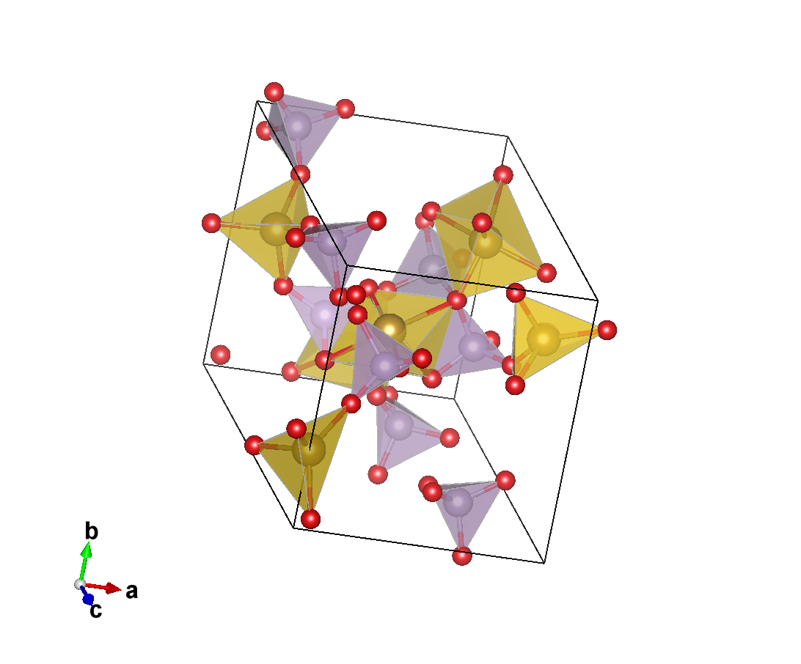
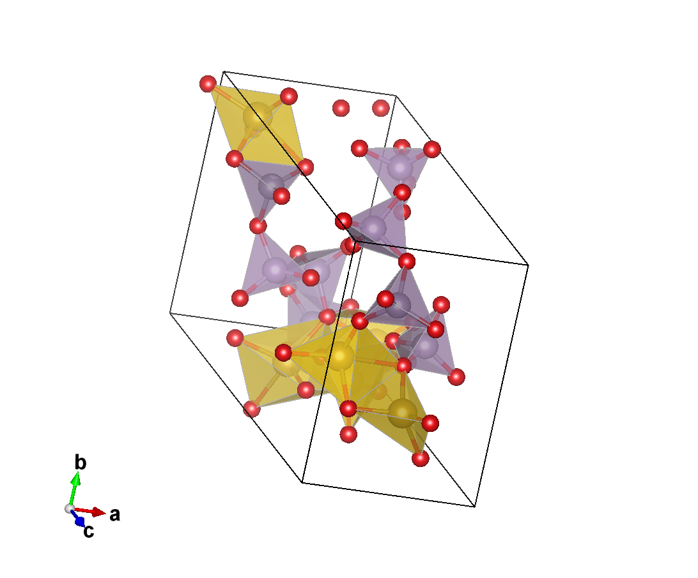
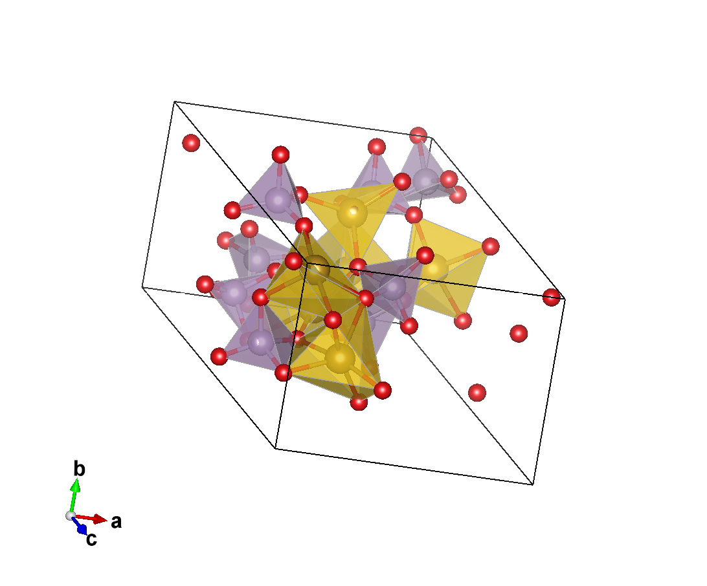
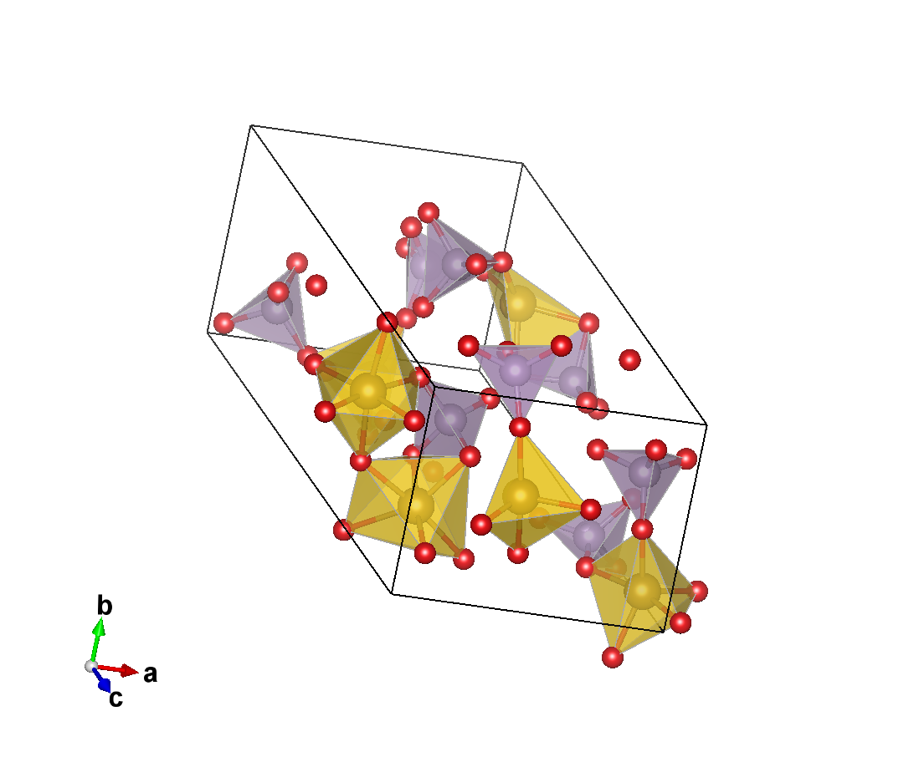
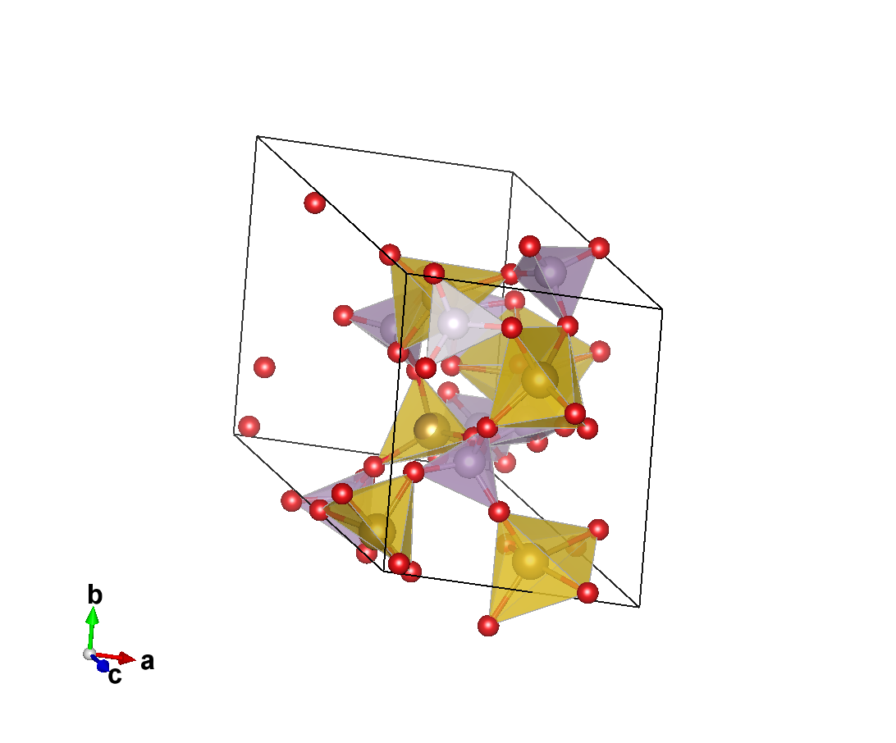
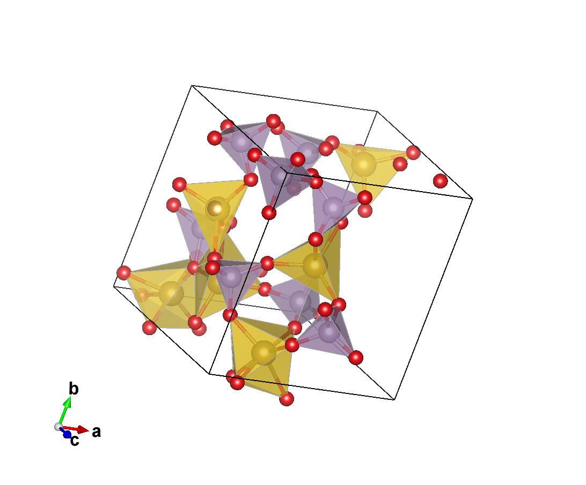
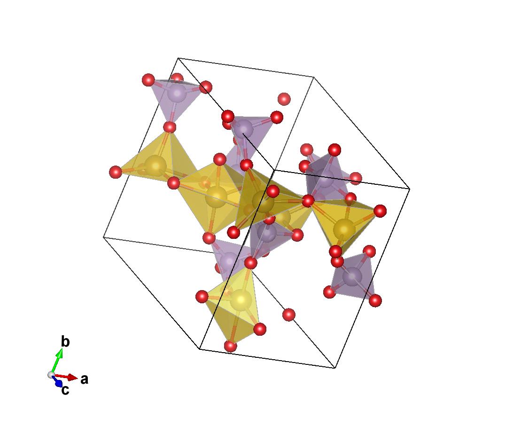
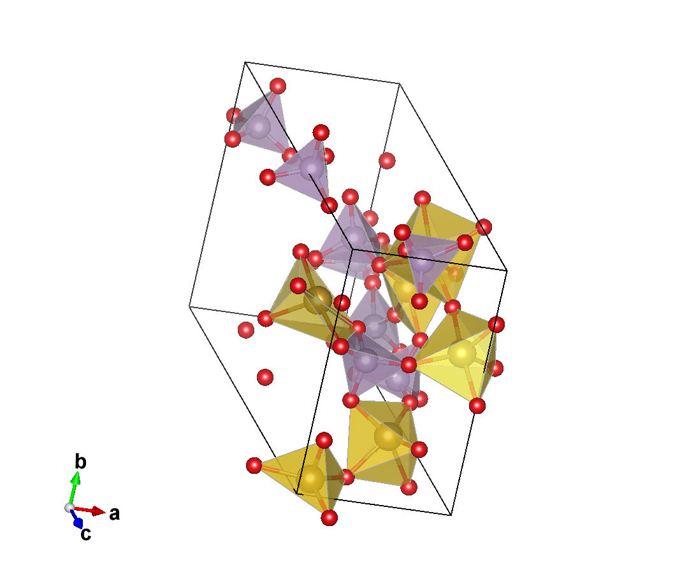

<p align="center">
  
</p>

# ShootingCSP (High-Precision Controllable Crystal Structure Generation)

[中文](README.md) | [English](README.en.md)

[](https://github.com/aoyang17/ShootingCSP/actions/workflows/ci.yml)
[](https://www.python.org/)
[](LICENSE)

ShootingCSP is a Python library for high-precision, controllable crystal structure generation. It formulates geometric/property constraints on target crystals as an optimization problem and progressively propagates them into generative inference, yielding crystals that conform to both the data manifold (prior knowledge of target crystals) and high-dimensional constraints. Its core algorithm, ShootingFlow, casts flow-matching inference and optimization as a boundary value problem solved via the shooting method from optimal control theory.

We take Na-Fe-P-O orthophosphate crystal generation mission as an example. The project comprises three modules: crystal representation, which parameterizes crystal encoding; generative architecture, which learns the mathematical manifold; and a surrogate model, which provides physical estimates. We describe these three components in turn.

## Installation

Install the development release from the repository:

```bash
python -m pip install -e ".[shooting]"
```

Core Python API:

```python
from shootingcsp.generation import optimize_source_with_surrogate
from shootingcsp.surrogate import SurrogateSpec, load_surrogate
from shootingcsp.training.train_flow import main as train_flow
```

Retrain or fine-tune the Flow:

```bash
python -m shootingcsp.training.train_flow --help
```

Dataset adapters and independent surrogate-model interfaces are documented in
[TrainingAndSurrogateInterfaces.md](docs/TrainingAndSurrogateInterfaces.md).

The initial library release is version `0.2.0` under the Apache License 2.0. Citation
metadata is provided in `CITATION.cff`.

## Constraint-driven generation

All physical constraints, objective thresholds, and ShootingFlow soft-penalty
weights are controlled by a versioned JSON configuration. Users can fill the
offline constraint builder at:

```text
docs/shootingflow_constraint_builder.html
```

After exporting `shootingcsp.constraints.json`:

```bash
shootingcsp-validate-constraints --constraints shootingcsp.constraints.json
shootingcsp-generate   --constraints shootingcsp.constraints.json   --flow /path/to/flow.pt   --profile /path/to/profile.json   --surrogate uma   --surrogate-checkpoint /path/to/uma.pt   --out /path/to/output
```

See [ConstraintConfiguration.md](docs/ConstraintConfiguration.md) for details.

## Crystal representation

I adopt the $(N, \mathbf{A}, \mathbf{X}, \mathbf{L})$ crystal representation strategy, where:

- $N \in \mathbb{Z}_{>0}$ is the total number of atoms in the periodic cell;
- $\mathbf{A} = (a_i)_{i=1}^{N}$ specifies the element at each atomic site;
- $\mathbf{X} = (x_i)_{i=1}^{N}$, with $x_i \in [0,1)^3$, specifies the atomic positions within the cell, and is also the atomic-position variable updated by the original relaxation task;
- $\mathbf{L} \in \mathbb{R}^{3\times3}$ specifies the cell size and shape, and is the variable updated by the original relaxation task through the cell filter.

These four components together form the design variables of the generative optimization problem.

## Generative architecture

1. Fix the discrete composition first: N = 52, A = Na6Fe6P8O32; optimize only the Flow source variables z_X and z_L.
2. Use a frozen geometry Flow and perform 12 source-space Adam steps, backpropagating through the full 48-step midpoint ODE at every step.
3. Optimize a soft objective: UMA energy plus differentiable distance, P/Fe-coordination, volume, and source-prior penalties.
4. Re-integrate the optimized source with no gradients to obtain the final generated structure.
5. Apply a catastrophic precheck for non-finite cells, invalid density/conditioning, and severe atomic overlaps.
6. Relax the surviving structure with fixed-cell UMA/FIRE, then evaluate exact hard gates: composition, charge, PBC distances, CN(P)=4, configurable CN(Fe) ⊆ {4,5,6}, polyhedron centers, Fe sharing, oxygen coverage, and force convergence.
7. Require finite-reference E_hull^UMA ≤ 0.15 eV/atom; at fixed composition, minimizing UMA energy is equivalent to minimizing the active hull gap.
8. Only after all hard gates pass, apply framework novelty and diversity checks with Na removed: no known Fe–P–O structure/topology match, sufficient descriptor distance, no cross-candidate duplicate, and successful CIF round-trip.
9. Accept candidates incrementally as streaming outputs; novelty and hull stability are final gating/selection criteria, not terms in the source-space generation loss.


### ShootingFlow · Optimization problem formulation | Take Na-Fe-P-O generation for example

| Type | Item | Requirement / Definition | Current Result / Notes |
|---|---|---|---|
|  | Stability: minimize $E_{\mathrm{hull}}$ | $\le 150\ \text{meV/atom}$ | ✓ Result range: 122–168 meV/atom; 50% compliant |
|  | Novelty: maximize $f_{\mathrm{nov}}$ | Fe–P–O framework after alkali-metal removal | ✓ No match to known structures |
|  | Number of atoms | $N\in\mathbb Z_{>0}$ | Total number of atoms in the periodic cell. |
|  | Element sequence | $\mathbf A=(a_i)_{i=1}^{N}$ | Specifies the element at each atomic site. |
|  | Fractional coordinates | $\mathbf X=(\mathbf x_i)_{i=1}^{N},\ \mathbf x_i\in[0,1)^3$ | Specifies atomic positions within the cell; also the atomic-position variable updated by the original relaxation task. |
|  | Lattice matrix | $\mathbf L\in\mathbb R^{3\times3}$ | Specifies cell size and shape; also the variable updated by the original relaxation task through the cell filter. |
|  | Elemental composition | Only Na, Fe, P, O, and all four elements present | ✓ Na<sub>6</sub>Fe<sub>6</sub>P<sub>8</sub>O<sub>32</sub> |
|  | Average formal valence of Fe | $\bar z_{\mathrm{Fe}} \ge 2$ | ✓ $\bar z_{\mathrm{Fe}} = 3.0$ |
|  | Theoretical specific capacity | $C_{\mathrm{th}} \ge 130$ mAh g$^{-1}$ | ✓ 130.4 mAh g$^{-1}$ |
|  | Volume | 10.5–20.5 Å$^3$/atom | ✓ 12.91–16.41 Å$^3$/atom |
|  | Number of atoms in primitive cell | $23 \le N_{\mathrm{prim}} \le 184$ | ✓ Current cell $N = 52$ |
|  | PBC minimum distance | P–O $\ge 1.40$; Fe–O $\ge 1.55$; Na–O/O–O $\ge 2.00$; P–P $\ge 2.60$; Na–Na $\ge 2.20$ Å | ✓ No PBC overlaps; P–O 1.474–1.652 Å, Fe–O 1.791–2.428 Å |
|  | P–O coordination | $r_{\mathrm{P-O}} \le 2.00$ Å; CN(P) = 4 | ✓ All PO<sub>4</sub>; 8/8 P pass |
|  | Fe–O coordination | $r_{\mathrm{Fe-O}} \le 2.50$ Å; CN(Fe) ∈ {4,5,6} | ✓ 6 Fe per cell; all FeO<sub>4</sub>/FeO<sub>5</sub>/FeO<sub>6</sub> |
|  | P/Fe polyhedron centers | P and Fe strictly located inside their respective O polyhedra | ✓ 14/14 P and Fe centers pass |
|  | Fe polyhedron adjacency | Any Fe–Fe shared O count $\le 2$ | ✓ No two Fe–O coordination polyhedra share the same oxygen triangular face |
|  | Oxygen coverage | All O covered by framework polyhedra | ✓ 32/32 O covered |
|  | UMA $E_{\mathrm{hull}}$ | $E_{\mathrm{hull}}^{\mathrm{UMA}} \le 150$ meV/atom | ✓ 100.00–146.21 meV/atom |
|  | Atomic force convergence | $F_{\max} \le 0.03$ eV Å$^{-1}$ | ✓ 0.01874–0.02996 eV Å$^{-1}$ |

## Surrogate model

In this study, we employ [UMA](https://arxiv.org/abs/2506.23971) as a force-field surrogate model to provide the partial derivatives of the energy above the convex hull, $E_{\mathrm{hull}}$, and the force, $F$, with respect to the atomic coordinates $X$ and lattice parameters $L$:

$$
\frac{\partial E_{\mathrm{hull}}}{\partial X},\quad
\frac{\partial E_{\mathrm{hull}}}{\partial L},\quad
\frac{\partial F}{\partial X},\quad
\frac{\partial F}{\partial L}.
$$
## Entrypoints

- `tools/run_uma_campaign.py`: resumable multi-worker generation, relaxation,
  gates, hull proxy, and incremental selection.
- `tools/generate_uma_guided_framework_candidates.py`: single-batch generation
  and UMA-guided source optimization.
- `tools/select_framework_candidates.py`: offline strict selection and ranking.
- `tools/audit_uma_campaign.py`: independent final-CIF validation.
- `tools/audit_crossmetal_novelty.py`: the September 11 cross-metal novelty audit.

`runs/` is a symlink to the immutable 9.10–9.11 experiment assets, including
the flow checkpoint, conditioning profile, reference labels, campaign records,
and selected structures.

## Run the campaign

```bash
tools/launch_uma_campaign.sh
```

Use `tools/launch_uma_campaign.sh --audit` to revalidate the campaign's
exported CIFs. See [UMACampaign24.md](docs/UMACampaign24.md) for the frozen
protocol and artifact layout.

## Gallery

Eight of the 19 validated Na–Fe–P–O structures are shown below in a random sample. Files follow `Sxx_LE_n4_n5_n6_Eh_vv_Q.png`, where `n4`, `n5`, and `n6` are the numbers of FeO<sub>4</sub>, FeO<sub>5</sub>, and FeO<sub>6</sub> centers, `vv` is the MP2020 E<sub>hull</sub> in meV/atom, and `Q` is `T`/`F` for an unmatched/matched known structure. Click an image to open the full-resolution file; [view all 19 structures](asset/crystal/).

CIF and VESTA PNG outputs now share one stem generated globally by `shootingcsp.naming`. Final selected outputs use `Sxx_LE_n4_n5_n6_Eh_vv_Q.{cif,png}`; intermediate exports not yet audited for hull/novelty use `Eh_NA_U`. Use the global CLI to inspect names or render the PNG headlessly:

```bash
shootingcsp-name-output --index 1 --n4 0 --n5 5 --n6 1 --eh-meV-atom 143 --kind paths
shootingcsp-render-vesta --cif selected/S01_LE_0_5_1_Eh_143_T.cif
```

<table>
  <tr>
    <td align="center" width="25%">
      <a href="asset/crystal/S10_LE_3_3_0_Eh_154_T.png"></a><br>
      <sub><b>S10</b> · LE 3/3/0 · E<sub>hull</sub> 154 meV/atom</sub>
    </td>
    <td align="center" width="25%">
      <a href="asset/crystal/S08_LE_2_3_1_Eh_156_T.png"></a><br>
      <sub><b>S08</b> · LE 2/3/1 · E<sub>hull</sub> 156 meV/atom</sub>
    </td>
    <td align="center" width="25%">
      <a href="asset/crystal/S03_LE_1_4_1_Eh_168_T.png"></a><br>
      <sub><b>S03</b> · LE 1/4/1 · E<sub>hull</sub> 168 meV/atom</sub>
    </td>
    <td align="center" width="25%">
      <a href="asset/crystal/S13_LE_3_1_2_Eh_141_T.png"></a><br>
      <sub><b>S13</b> · LE 3/1/2 · E<sub>hull</sub> 141 meV/atom</sub>
    </td>
  </tr>
  <tr>
    <td align="center" width="25%">
      <a href="asset/crystal/S06_LE_1_4_1_Eh_122_T.png"></a><br>
      <sub><b>S06</b> · LE 1/4/1 · E<sub>hull</sub> 122 meV/atom</sub>
    </td>
    <td align="center" width="25%">
      <a href="asset/crystal/S11_LE_2_2_2_Eh_145_T.png"></a><br>
      <sub><b>S11</b> · LE 2/2/2 · E<sub>hull</sub> 145 meV/atom</sub>
    </td>
    <td align="center" width="25%">
      <a href="asset/crystal/S19_LE_0_5_1_Eh_141_T.png"></a><br>
      <sub><b>S19</b> · LE 0/5/1 · E<sub>hull</sub> 141 meV/atom</sub>
    </td>
    <td align="center" width="25%">
      <a href="asset/crystal/S14_LE_1_4_1_Eh_158_T.png"></a><br>
      <sub><b>S14</b> · LE 1/4/1 · E<sub>hull</sub> 158 meV/atom</sub>
    </td>
  </tr>
</table>
